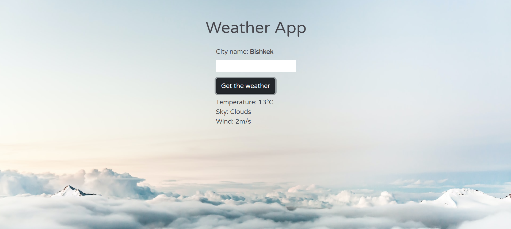

# Weather APP
Weather App using API

> This is an assigment for Microverse JavaScript course. The goal is to create a website using JavaScript API to show weather in the city.



Additional description about the project and its features.

## Live Version

[Live Weather APP](https://rawcdn.githack.com/NiiazalyDzhumaliev/weatherApp/2b17860b31bd2f2187bc9698f60bdcefecec23a8/dist/index.html)

## Built With

- HTML,
- CSS,
- JavaScript,
- npm,
- webpack, 
- OpenWeatherApi


## Getting Started

To get a local copy up and running follow these simple example steps.

### Prerequisites

- A compatible browser with HTML, CSS and JavaScript. 

### Install

```
- git clone https://github.com/NiiazalyDzhumaliev/weatherApp.git;
- cd weatherapp/
- npm install
- npm webpack --watch
```

### Usage

- Open the index.html file in any browser or edit using Visual Code or the preference IDE for web development


## Author

👤 **Niiazaly Dzhumaliev**

- Github: [@NiiazalyDzhumaliev](https://github.com/NiiazalyDzhumaliev)
- Twitter: [@Niiazaly1](https://twitter.com/Niiazaly1)
- Linkedin: [@niiazaly-dzhumaliev](https://www.linkedin.com/in/niiazaly-dzhumaliev-117707132/)

## 🤝 Contributing

Contributions, issues and feature requests are welcome!

Feel free to check the [issues page](https://github.com/NiiazalyDzhumaliev/weatherApp/issues).

## Show your support

Give a ⭐️ if you like this project!

## Acknowledgments

- The Odin Project
- unsplash.com: [Author of the background image](https://unsplash.com/photos/FIKD9t5_5zQ?utm_source=unsplash&utm_medium=referral&utm_content=creditShareLink)

## 📝 License

This project is free to use as learning purposes. For any external content (e.g. logo, images, ...), please contact the proper author and check their license of use.


